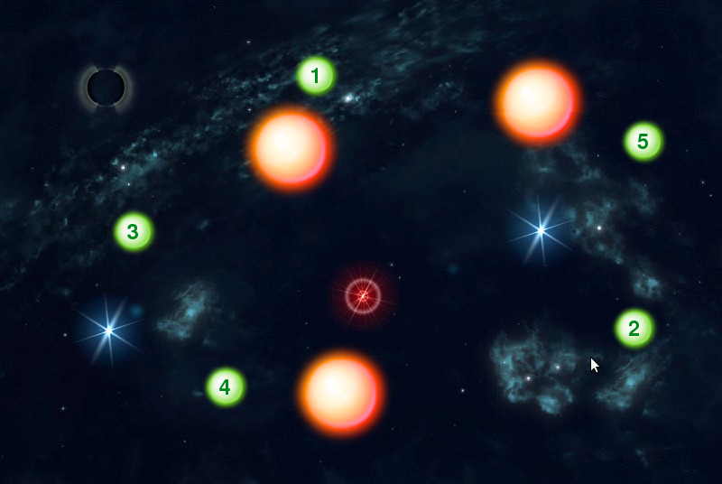

This simple app was used for as a midterm exam for students of the basic Java course at Charles University in Prague. It contains a simple game engine written in Java which acts as a server accepting connections from TCP clients. The task for the students was to implement the client communicating with the server in order to navigate an flying entity through the space.


# Import as a project into Eclipse

The project contains two launch configurations located in the [`.launch`](.launch/) directory.
- `JavaGameExam (Client).launch` : Server is implemented in
  [`javatest.game.Server`](src/javatest/game/Server.java)
- `JavaGameExam (Server).launch` : Client is implemented in
  [`javatest.game.client.Client`](src/javatest/game/client/Client.java)

- Animated images are located in [`src/images`](src/images/)
- Source files of animated images are located in [`imgdev`](imgdev/) use GIMP to edit
- `lib/commons-io-2.0.1.jar` is used for reading images from within the JAR file

# Assignment for Students

## Introduction
What you see from our overhead projector is an interactive game that simulates
a simple 2D world with several physical objects such as repulsors or dangerous mines.



Your task is to programm the client code of this interactive game that will guide your
physical entity safely through the screen while at the same time collecting all the green
numbered tokens in a given order. Once your entity has collected the last number, you
have successfully passed the exam.

There is a binary TCP-based protocol specified for the communication between the client and the server.
For the purpose of this exam, the server runs at host `u2-0.ms.mff.cuni.cz` port `20000`.
> **Hint:** A typical solution is approx. 150 lines of code long

## Game rules

The player controls an entity by sending messages to the server.
An entity can move through the space by increasing its acceleration to a given direction.
(the server is responsible for computing vectors and moving the entity according to the physical rules of the game)
The goal is to collect all **tokens** - green circles numbered in ascending order 1 .. 5.
(Incorrect order would be 1,2,**4**,3,5)
The entity should avoid collisions with dangerous **mines** and touching tokens with a wrong sequence number.
 
 - Touching a **mine** terminates the TCP connection.
 - Touching a **wrong token** teleports the entity to the entry point and resets the token sequence to 1.
 
The movement of our entity is also affected by force-fields of repulsors.

| Repulsor | Mines | Player Start |
|----------|------|--------------|
|  |  | 

| Entities of various colors |
|----------------------------|
| 

| Numbered tokens |
|-----------------|
| 


## Your task

As already mentioned, the server is responsible for simulating the physical reality of the game.
You programm doesn't need any velocity/acceleration-related information.
The responsibility of your client code is only to perform real-time decisions about the entity's behaviour in order to collect all tokens in the ascending order. This is achieved by sending one of the two possible messages to the server - **follow** or **evade**.
When your entity approaches a dangerous object (a mine or a wrong token), your client will get a **proximity warning** message from the server.

### Messages from the server
Throughout the game, the server is sending asynchronous messages to the client with max. latency of 100ms.
As a first burst of messages, the server send a list of objects visible in the game.
Only the mines and tokens are relevant for your task, so you can ignore other objects, such as repulsors.
```
BYTE : message type, here the message type is 0 = "entity info"
BYTE : object type, one of 1=Mine, 2=Token, 3=Other,
INT  : unique object identifier
```

When the current token sequence number changes, the server sends the following message:
```
BYTE : message type, here it is 1 = "current token"
INT  : object identifier which represents the current token
```

If the entity get too close to a dangerous object, the server send the following message:
```
BYTE : message type, here it is 2 = proximity warning
INT  : object identifier (always either a mine or a wrong token)
```
> **Note:** A proximity warning is sent only once per 100ms, therefore you should keep some kind of a couter in your code.

### Messages from client to server

The client should drive the movement of the entity by seding either a **follow** message or **evade** message.
> **Note:** Your client should not send messages faster than every 20ms.

```
BYTE : message type, here it is 3 = follow entity
INT  : object identifier
```

```
BYTE : message type, here it is 4 = evade entity
INT  : object identifier
```

Good luck.
